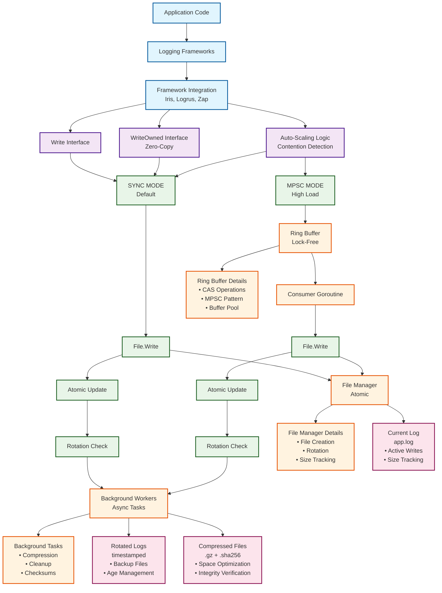

# Lethe: Super High-Performance Log Rotation for Go
### an AGILira fragment

Lethe is a lock-free log rotation library for Go, built for applications that demand maximum performance, automatic file management, and production-grade reliability — with intelligent auto-scaling between synchronous and asynchronous modes.

[](https://github.com/agilira/lethe/actions/workflows/ci.yml)
[](https://github.com/agilira/lethe/actions/workflows/ci.yml)
[](https://goreportcard.com/report/github.com/agilira/lethe)
[](.)

### Features
- **Zero-Lock Architecture**: Atomic operations and CAS-based coordination eliminate mutex overhead
- **Auto-Scaling Performance**: Intelligent switching between sync and MPSC modes based on contention
- **Zero-Allocation Hot Paths**: Pre-allocated buffers and time caching reduce GC pressure
- **Universal Compatibility**: Direct `io.Writer` implementation works with any logging framework
- **Native Iris Integration**: Specifically designed for Iris ultra-high performance logging
- **Built to Scale** - handle millions of log entries with minimal latency

## Architecture

Lethe provides intelligent log rotation through lock-free algorithms and adaptive performance scaling:



- Zero-lock operations with atomic coordination
- Auto-scaling between sync/async modes
- Background compression and integrity checks

## Performance

Lethe is engineered for ultra-high performance logging. The following benchmarks demonstrate sustained throughput with minimal overhead and intelligent auto-scaling.

```
Write Performance (Sync Mode):            ~3.3 μs/op     (zero-lock operations)
Write Performance (MPSC Mode):            ~3.3 μs/op     (multi-producer scaling)
High Contention (Sync):                   ~109 ns/op     (atomic coordination)
High Contention (MPSC):                   ~105 ns/op     (lock-free scaling)
Zero-Allocation Hot Paths:                0 B/op         (pre-allocated buffers)
Throughput Scaling:                       1-1000+ goroutines (adaptive buffering)
```

**Native Integration:**
- **Iris** - Native integration with zero-copy `WriteOwned()` API
- **Standard Library** - Direct `io.Writer` implementation
- **Universal Compatibility** - Works with any logging framework

**Framework Support:**
- **Logrus** - Drop-in replacement via `logrus.SetOutput(rotator)`
- **Zap** - Core integration via `zapcore.AddSync(rotator)`
- **Zerolog** - Direct integration via `zerolog.New(rotator)`

> **For Maximum Performance**: Use Iris integration with `WriteOwned()` for zero-copy transfers.
> This achieves the highest throughput with minimal memory allocations.
> See [docs/QUICK_START.md](docs/QUICK_START.md) for complete integration examples.

## Installation

```bash
go get github.com/agilira/lethe
```

## Quick Start

```go
import "github.com/agilira/lethe"

// Create logger with sensible defaults
logger, err := lethe.NewWithDefaults("app.log")
if err != nil {
    log.Fatal(err)
}
defer logger.Close()

// Use as io.Writer - works with any logging framework
logger.Write([]byte("Hello, Lethe!\n"))
```

## Use Cases

- **Ultra-High Performance Logging**: Iris integration with zero-copy transfers
- **Microservices Logging**: Automatic rotation with compression and cleanup
- **High-Throughput Applications**: Auto-scaling between sync/async modes
- **Production Systems**: Crash-safe operations with integrity checks
- **Container Environments**: Automatic file management and rotation

## The Philosophy Behind Lethe

In Greek mythology, Lethe was one of the Oceanids, the daughters of Oceanus and Tethys. As the personification of forgetfulness, Lethe possessed the power to grant oblivion and renewal—the ability to cleanse the past and provide fresh beginnings without the burden of accumulated history.

This embodies Lethe's design philosophy: intelligent log management that gracefully handles the past (old log files) while ensuring the present (current logging) operates at maximum efficiency. Like the Oceanid who could wash away memories, Lethe automatically manages log rotation and cleanup, allowing applications to focus on their core functionality without being weighed down by log file management.

Lethe doesn't just rotate logs—it intelligently manages the entire logging lifecycle, adapting to your application's performance needs while maintaining the reliability and efficiency that production systems demand, just as the Oceanid Lethe provided renewal and fresh starts in the ancient myths.

### File System Security

Lethe includes production-grade file system security with path validation and permission management:

```go
// Default security configuration
config := &lethe.LoggerConfig{
    Filename:           "app.log",
    MaxSizeStr:         "100MB",
    MaxBackups:         10,
    Compress:           true,
    Checksum:           true, // SHA-256 integrity checks
    LocalTime:          true,
    ErrorCallback: func(op string, err error) {
        // Custom error handling for security events
        log.Printf("Lethe security event [%s]: %v", op, err)
    },
}
```

> **Security Notes**: Lethe automatically validates file paths and prevents directory traversal attacks.
> For production deployments, ensure proper file permissions and consider using dedicated log directories.
> Enable checksums for log integrity verification in security-critical environments.

## Documentation

**Quick Links:**
- **[Quick Start Guide](./docs/QUICK_START.md)** - Get running in 2 minutes
- **[API Reference](./docs/API.md)** - Complete API documentation  
- **[Architecture Guide](./docs/ARCHITECTURE.md)** - Deep dive into zero-lock log rotation design
- **[Examples](./examples/)** - Production-ready integration patterns

## License

Lethe is licensed under the [Mozilla Public License 2.0](./LICENSE.md).

---

Lethe • an AGILira fragment
